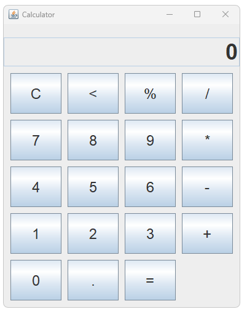
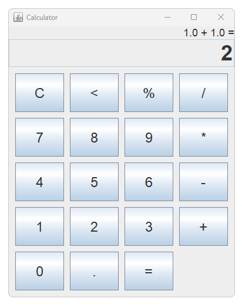

# 🧮 Modern Calculator – Java Swing Application

A simple, stylish, and user-friendly **calculator** built using **Java Swing**. This desktop application includes basic arithmetic operations and a responsive GUI with real-time input display.

---

## 🚀 Features

- ✅ Modern & clean user interface  
- ✅ Real-time input display  
- ✅ Basic arithmetic: `+`, `−`, `×`, `÷`  
- ✅ Responsive buttons  
- ✅ Java Swing GUI  
- ✅ Ready to run in DrJava or any IDE  

---

## 📸 Screenshot

---

## 📦 Installation & Setup

### ✅ Prerequisites

Ensure you have the following installed:

- **Java JDK 8 or higher**  
  [Download Java JDK](https://www.oracle.com/java/technologies/javase-downloads.html)

- **Java IDE** (DrJava, IntelliJ, Eclipse, etc.)

---
